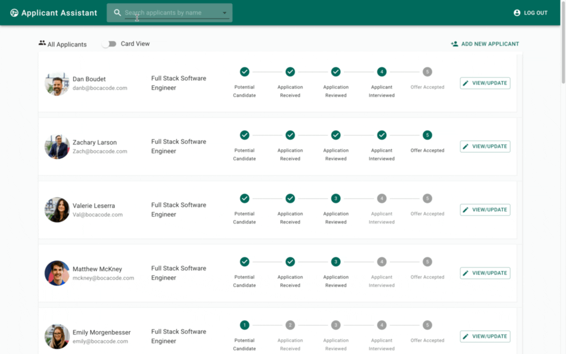

# Applicant Assistant

This is a very simple, but fully functional applicant tracking system, built on React. Meant to serve small businesses, nonprofits, or anyone who just needs a simple way to track and organize incoming job applicants. *It could also be easily adapted for any decision process that involves selecting from multiple applicants, such as (RFPs).

**_*This was developed over a two-week period as a course project. It is functional, but only really intended for personal/educational use._**

A demo can be found here:
[http://dboudet-ats.s3-website-us-east-1.amazonaws.com/](http://dboudet-ats.s3-website-us-east-1.amazonaws.com/)

Below you can find screen recordings demonstrating the available functionality:

### Multiple List Views

### Update Applicants' Progress

### Easily Add New Candidates

### Find Applicants by Name

